# Лабораторная работа №2: Введение в WordPress

## Цель работы
Научиться устанавливать WordPress в локальной среде, освоить админ-панель, изменять внешний вид сайта через темы и расширять функциональность с помощью плагинов.

---

## Ход выполнения работы

### Шаг 1. Подготовка среды
- Установлен XAMPP для локального сервера.
- Запущены модули Apache и MySQL.
- Проверено открытие `http://localhost`.
- Создана база данных `cms2` через phpMyAdmin.

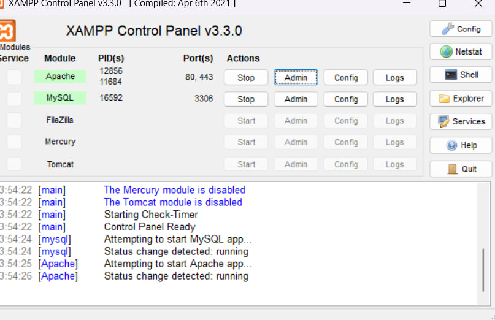

---

### Шаг 2. Установка WordPress
- Скачан WordPress с [официального сайта](https://wordpress.org/).
- Распакован в папку `htdocs/cms2`.
- В браузере открыт `http://localhost/cms2` и пройдена стандартная установка.

---

### Шаг 3. Первоначальные настройки сайта
- В админ-панели изменено название сайта и часовой пояс (`Settings → General`).
- В `Settings → Permalinks` выбран вариант **Post name** для удобных ссылок.

!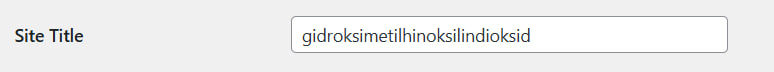
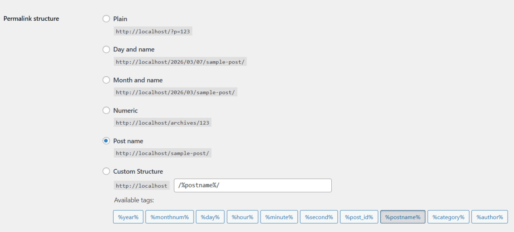

---

### Шаг 4. Работа с темами
- Перейдено в `Appearance → Themes`.
- Установлена и активирована тема **Astra** из официального каталога.
- Настроены:
  - Логотип сайта.
  - Цветовая схема.
  - Заголовок и описание сайта (`Appearance → Customize`).

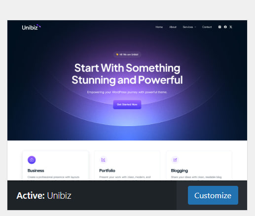

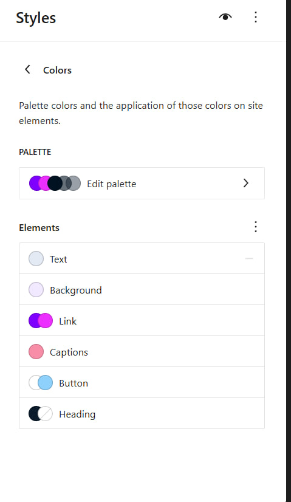
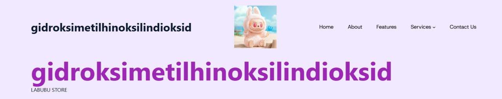

---

### Шаг 5. Работа с плагинами
- В `Plugins → Add New` установлены и активированы:
  - **Classic Editor** для классического редактора.
  - **Contact Form 7** для формы обратной связи.
- Проверена работа новых функций: добавление записи с Classic Editor и создание формы через Contact Form 7.
- В `Plugins → Installed Plugins` отключен один из плагинов, проверено, что его функции исчезли.

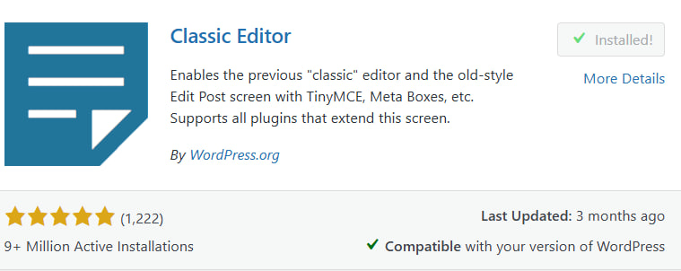
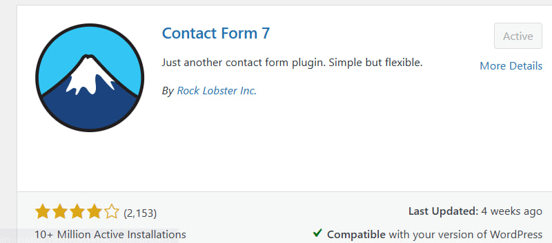

---

### Шаг 6. Создание контента
- Создана страница **Контакты** с формой обратной связи.
- Созданы несколько записей в блоге с различным контентом (текст, изображения).
- Проверено отображение контента на сайте.

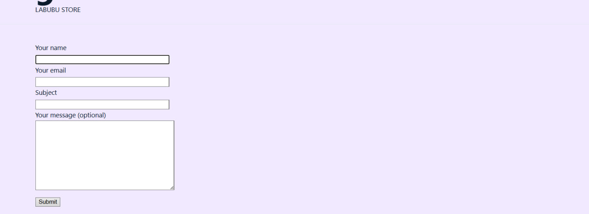
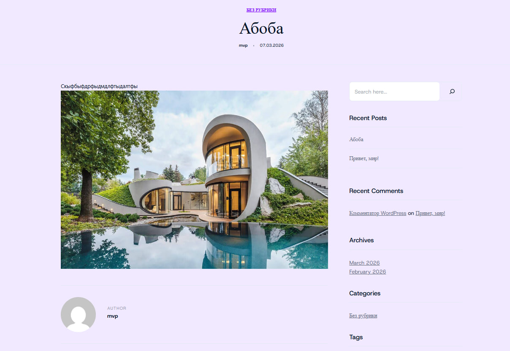
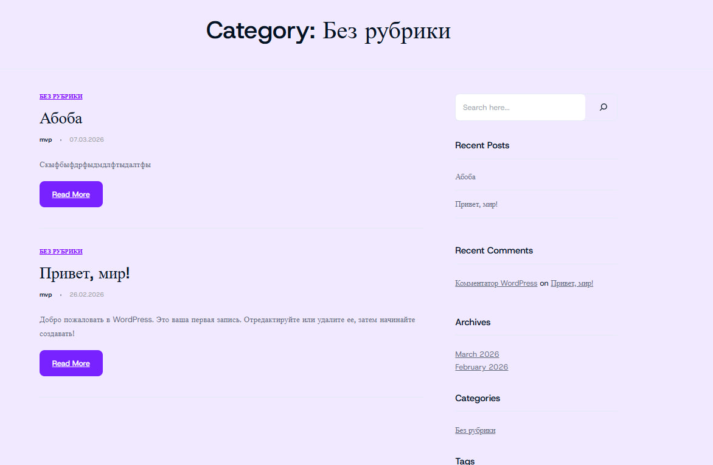

---

## Контрольные вопросы

**1. Что делает тема в WordPress, а что — плагин?**  
Тема отвечает за внешний вид сайта: оформление страниц, шрифты, цвета, расположение блоков. Плагин добавляет или расширяет функциональность сайта, не изменяя его дизайн напрямую (например, контактные формы, SEO-инструменты, слайдеры).

**2. Почему при смене темы контент сайта не теряется?**  
Контент хранится в базе данных WordPress отдельно от темы. Смена темы меняет только визуальное отображение страниц и элементов сайта, а текст, изображения и записи остаются сохраненными.

**3. Как можно изменить внешний вид сайта без редактирования кода?**  
Через админ-панель WordPress в разделе `Appearance → Customize` можно менять логотип, цвета, шрифты, меню, виджеты и другие элементы темы, не трогая исходный код.