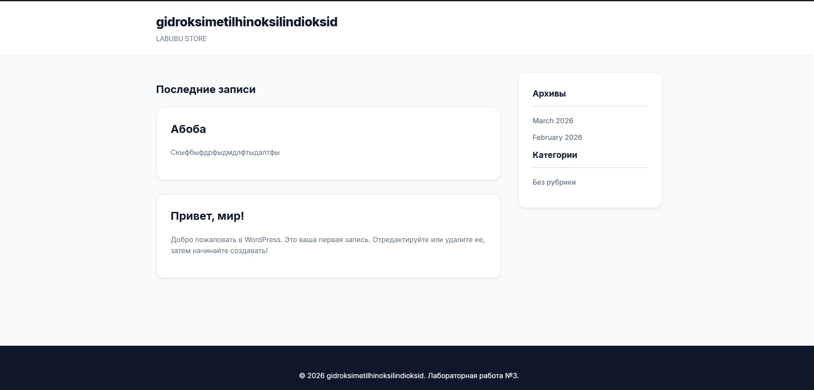
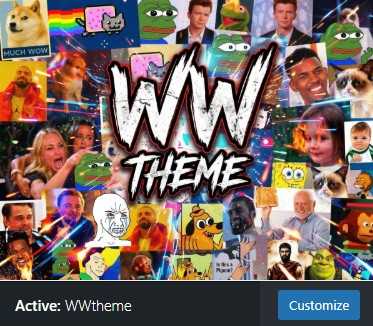

# Лабораторная работа №3

## Разработка простой темы WordPress

**Студент:** Виктор Купчишин
**Группа:** IA2303

---

# Описание лабораторной работы

Целью данной лабораторной работы является изучение структуры темы WordPress и принципов её разработки. В процессе выполнения работы была создана собственная тема под названием **WWtheme**, которая включает основные шаблоны WordPress и базовую структуру отображения сайта.

WordPress использует систему шаблонов (Template Hierarchy), которая определяет, какой файл темы используется для отображения различных страниц сайта. Благодаря этому можно создавать отдельные шаблоны для главной страницы, отдельных записей, страниц сайта и архивов.

В рамках лабораторной работы была разработана простая тема, включающая шапку сайта, основной контент, боковую панель и подвал. Также реализован вывод записей с помощью цикла WordPress и подключение пользовательских стилей.

---

# Инструкции по запуску проекта

Для запуска темы необходимо выполнить следующие шаги.

1. Установить WordPress на локальный сервер.

2. Перейти в папку:

```
wp-content/themes
```

3. Создать папку темы:

```
WWtheme
```

4. В папке темы разместить файлы:

```
style.css
functions.php
header.php
footer.php
index.php
single.php
page.php
archive.php
sidebar.php
comments.php
```

5. В файле **wp-config.php** включить режим отладки:

```php
define('WP_DEBUG', true);
```

6. Добавить файл изображения:

```
screenshot.png
```

Размер изображения:

```
1200x900 px
```

7. Перейти в админ-панель WordPress:

```
Appearance → Themes
```

8. Активировать тему **WWtheme**.

После этого сайт будет отображаться с использованием созданной темы.

---

# Краткая документация к теме

Тема **WWtheme** состоит из нескольких файлов, каждый из которых выполняет определённую функцию.

---

## style.css

Файл содержит стили оформления сайта.

В нём реализованы:

* CSS-переменные для цветов и параметров
* стили шапки сайта
* стили карточек записей
* стили боковой панели
* стили подвала
* адаптивная структура страницы

Используются современные возможности CSS, такие как:

* CSS variables
* Flexbox
* эффекты hover
* тени и скругления

---

## functions.php

Файл содержит функции темы.

В данной теме используется функция подключения стилей:

```php
function usm_theme_scripts() {
    wp_enqueue_style('usm-style', get_stylesheet_uri());
}

add_action('wp_enqueue_scripts', 'usm_theme_scripts');
```

Она подключает основной файл стилей `style.css`.

---

## header.php

Файл содержит шапку сайта.

В нём размещены:

* объявление HTML документа
* подключение функций WordPress
* заголовок сайта
* описание сайта

Основные функции:

```
bloginfo()
home_url()
wp_head()
```

---

## footer.php

Файл подвала сайта.

Он содержит:

* информацию о сайте
* текущий год
* название сайта

Также используется функция:

```
wp_footer()
```

которая необходима для корректной работы WordPress.

---

## index.php

Главный файл темы.

Он выводит **последние записи сайта**.

В коде используется класс `WP_Query`, который позволяет получить 5 последних постов:

```php
$args = array('posts_per_page' => 5);
$query = new WP_Query($args);
```

Каждая запись выводится в виде карточки с:

* заголовком
* ссылкой на запись
* кратким описанием (excerpt)

---

## single.php

Файл используется для отображения **отдельной записи**.

В шаблоне выводятся:

* заголовок записи
* полный текст записи
* комментарии

Комментарии подключаются через:

```
comments_template();
```

---

## page.php

Файл используется для отображения **обычных страниц сайта**.

Структура аналогична `single.php`, но применяется к страницам.

---

## archive.php

Файл отвечает за отображение **архивов записей**.

Например:

* архив по категории
* архив по дате
* архив по тегам

В шаблоне выводится:

* название архива
* список записей

---

## sidebar.php

Файл боковой панели.

Он содержит:

* архивы записей
* список категорий

Используются функции:

```
wp_get_archives()
wp_list_categories()
```

---

## comments.php

Файл отвечает за отображение комментариев.

Он содержит:

* список комментариев
* форму добавления комментария

Используемые функции:

```
wp_list_comments()
comment_form()
```

---

# Примеры использования темы

После активации темы **WWtheme** сайт начинает использовать созданные шаблоны.

Основные варианты использования:

**Главная страница**

Отображает последние 5 записей сайта.

**Страница записи**

При открытии поста используется файл `single.php`.

**Страница сайта**

Для обычных страниц используется `page.php`.

**Архив записей**

При просмотре категории или даты используется `archive.php`.

**Боковая панель**

Отображает список архивов и категорий.

**Комментарии**

Пользователи могут оставлять комментарии к записям.




---

# Ответы на контрольные вопросы

### Какие два файла являются обязательными для любой темы WordPress?

Обязательными файлами являются:

* `style.css`
* `index.php`

Без этих файлов WordPress не распознаёт тему.

---

### Как подключаются общие части шаблонов (header, footer, sidebar)?

Они подключаются с помощью специальных функций WordPress:

```
get_header();
get_footer();
get_sidebar();
```

Эти функции позволяют использовать одни и те же элементы на разных страницах сайта.

---

### Чем отличаются index.php, single.php и page.php?

`index.php` — основной файл темы, который используется по умолчанию.

`single.php` — шаблон для отображения отдельной записи.

`page.php` — шаблон для отображения статических страниц сайта.

---

### Зачем нужен файл functions.php в теме?

Файл `functions.php` используется для добавления функциональности в тему.

С его помощью можно:

* подключать стили и скрипты
* добавлять функции WordPress
* расширять возможности темы
* регистрировать дополнительные элементы интерфейса.

---

# Список использованных источников

1. WordPress — официальная документация
   [https://developer.wordpress.org/themes/](https://developer.wordpress.org/themes/)

2. WordPress Theme Handbook
   [https://developer.wordpress.org/themes/basics/](https://developer.wordpress.org/themes/basics/)

3. WordPress Codex
   [https://codex.wordpress.org/](https://codex.wordpress.org/)

---

# Дополнительные аспекты

При разработке темы WordPress важно правильно разделять структуру сайта на отдельные шаблоны. Это позволяет упростить поддержку проекта и повторное использование элементов интерфейса.

Созданная тема **WWtheme** реализует базовую архитектуру темы WordPress и может быть расширена в будущем добавлением:

* пользовательских меню
* виджетов
* адаптивного дизайна
* дополнительных шаблонов страниц.


