# Лабораторная работа №5  
## Безопасность WordPress

**Студент:** Виктор Купчишин

**Группа:** IA2303

### Цель работы
Закрепить ключевые практики безопасности WordPress: управление ролями пользователей и паролями, обновление ядра и плагинов, базовое hardening системы (защита wp-config.php, настройка прав доступа, отключение редактора файлов), создание резервных копий, мониторинг активности и настройка плагина безопасности All In One WP Security & Firewall.

---

# 1. Подготовка среды

В локальной среде разработки была использована платформа XAMPP с установленным WordPress.  
После установки системы был выполнен вход в административную панель WordPress с правами администратора.

Для удобства разработки и диагностики ошибок была включена отладка в файле `wp-config.php`:

```php
define('WP_DEBUG', true);
```


Это позволяет отображать сообщения об ошибках и предупреждения в процессе работы сайта.

---

# 2. Управление ролями и паролями

В административной панели был создан тестовый пользователь с ролью **Автор (Author)**.
Эта роль позволяет публиковать и редактировать собственные записи, но не дает доступа к административным настройкам сайта.

Для повышения безопасности были проверены пароли всех пользователей с правами администратора.
Пароли были заменены на сложные комбинации, содержащие более 8 символов, включая буквы, цифры и специальные символы.

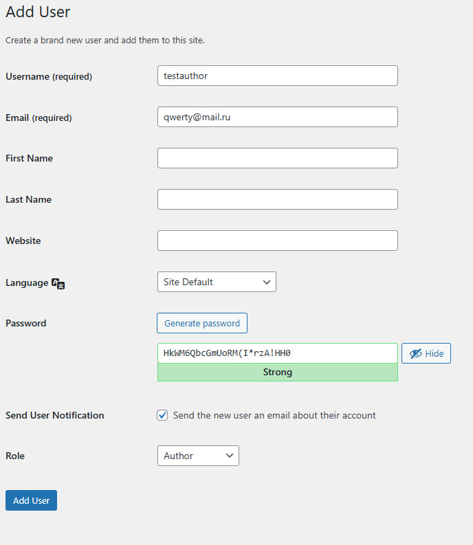

---

# 3. Обновление ядра, тем и плагинов

В разделе **Dashboard → Updates** была выполнена проверка обновлений.

Были обновлены:

* ядро WordPress
* установленные темы
* установленные плагины

После обновления была проверена корректность работы сайта.
Также были включены автоматические обновления для тем и плагинов, что позволяет автоматически устанавливать новые версии и повышает безопасность системы.

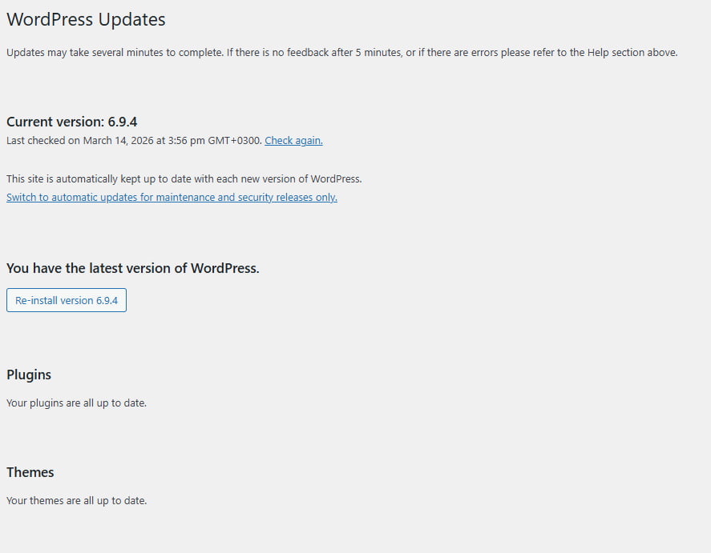

---

# 4. Базовое hardening системы

Для повышения безопасности WordPress были применены базовые меры защиты.

### Запрет редактирования файлов из админки

В файл `wp-config.php` была добавлена строка:

```php
define('DISALLOW_FILE_EDIT', true);
```

Это отключает встроенный редактор файлов тем и плагинов в панели администратора.

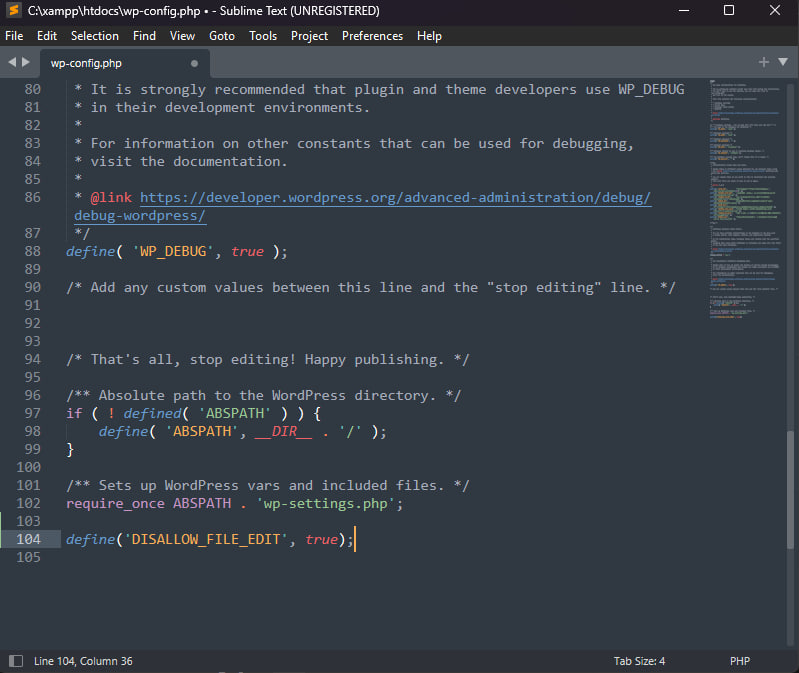

### Защита файла wp-config.php

В файл `.htaccess` была добавлена защита:

```apache
<files wp-config.php>
order allow,deny
deny from all
</files>
```

Это запрещает доступ к файлу конфигурации через веб-сервер.

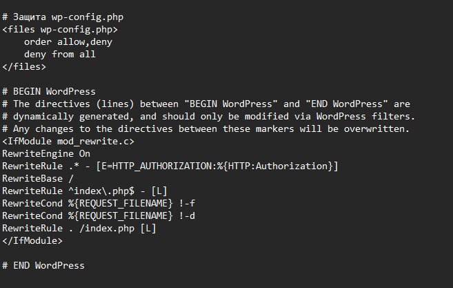

---

# 5. Установка и настройка All In One WP Security & Firewall

Для повышения безопасности был установлен плагин:

**All In One WP Security & Firewall (AIOS)**

После установки и активации были выполнены следующие настройки.

---

## User Login

Была включена защита **Login Lockdown**.

Параметры:

* Max Login Attempts — 5
* Login Retry Time Period — 15 минут
* Lockout Time — 30 минут

Также была включена функция **Force Logout**, ограничивающая время активной сессии пользователя.

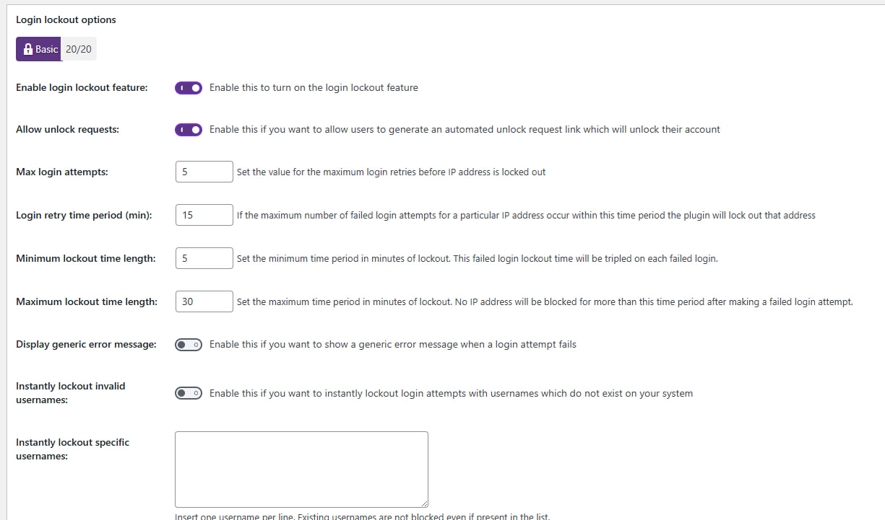
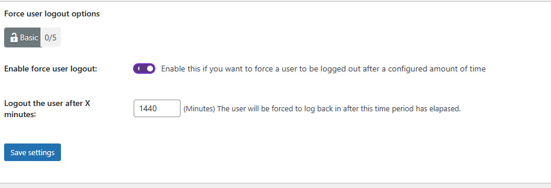

---

## User Accounts

Была выполнена проверка наличия пользователя с логином **admin**.
Если такой пользователь присутствует, его необходимо переименовать или удалить для повышения безопасности.

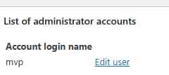

---

## User Registration

Было отключено автоматическое подтверждение регистрации пользователей, что предотвращает массовую регистрацию ботов.

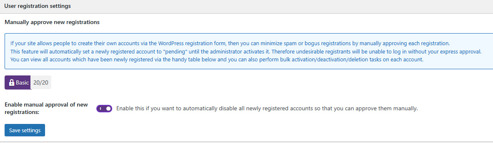

---

## Filesystem Security

Была запущена проверка прав доступа к файлам системы.
Плагин подтвердил корректность настроенных прав.

(Для Windows-систем некоторые проверки могут быть недоступны.)

---

## Firewall

Был активирован базовый уровень защиты **Basic Firewall**.

Включены следующие функции:

* защита от **Bad Query Strings**
* защита от **XSS-атак**
* отключение **Directory Browsing**

Это позволяет блокировать подозрительные запросы и предотвращать атаки через URL.

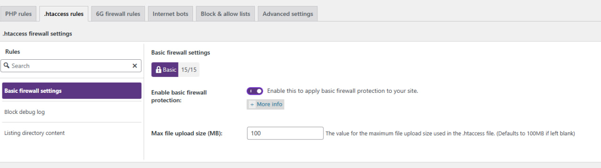
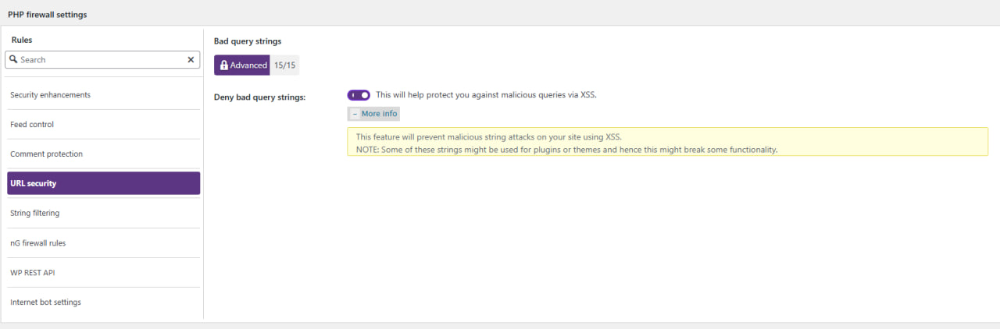
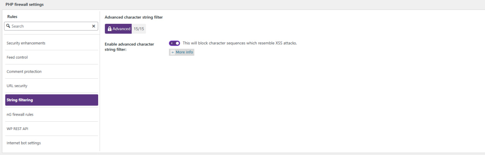
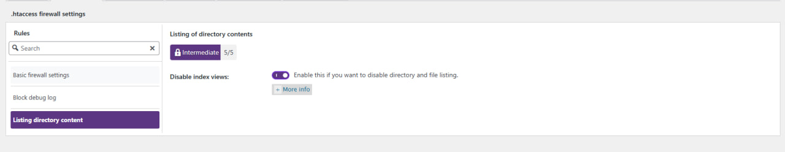

---

## Brute Force Protection

Была включена функция **Rename Login Page**.

Стандартный адрес входа:

```
/wp-login.php
```

был изменен на нестандартный адрес:

```
/login-test
```

Это позволяет скрыть страницу авторизации от автоматических атак.

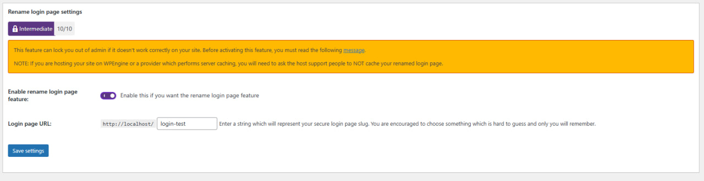

---

## Scanner / Malware

Была активирована функция **File Change Detection**.

Она отслеживает изменения файлов сайта и отправляет уведомления на электронную почту администратора.

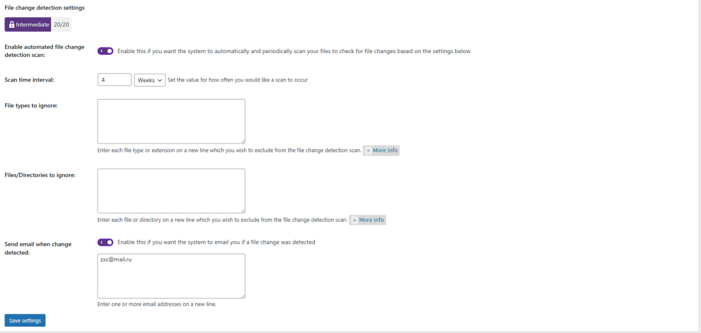

---

## Backup

В разделе **Database Backup** была создана резервная копия базы данных WordPress.

Доступны режимы:

* Manual Backup
* Automated Backup

Для лабораторной работы был выполнен **Manual Backup**.

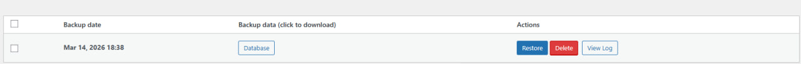

---

## Notifications

Были включены email-уведомления о важных событиях:

* блокировка IP
* создание нового администратора
* изменение файлов сайта

---

# 6. Проверка защиты от брутфорса

Для проверки защиты была выполнена попытка подбора пароля.

1. Выполнен выход из админ-панели.
2. Открыта страница входа через новый URL.
3. Введён неправильный пароль более 5 раз.

После превышения лимита попыток входа плагин автоматически заблокировал IP-адрес.

Информация о блокировке появилась в разделе:

```
WP Security → Dashboard → Logs
```

После проверки IP-адрес был разблокирован вручную.

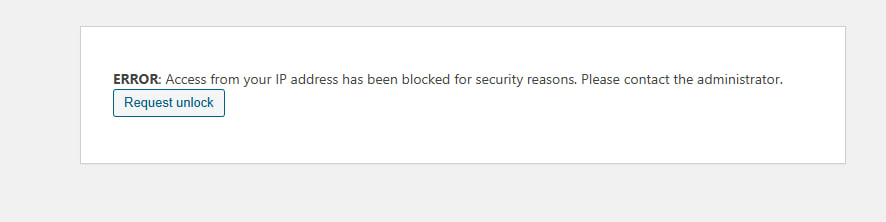
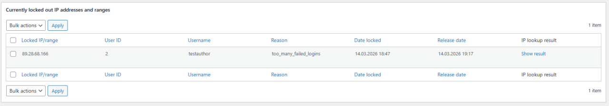
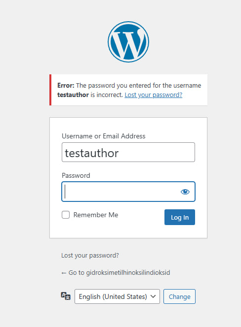

---

# 7. Восстановление из резервной копии

Для проверки резервного копирования были выполнены следующие действия.

1. Была удалена тестовая запись.
2. Было удалено одно изображение из медиатеки.
3. Выполнено восстановление базы данных из ранее созданного SQL-бэкапа.

После восстановления данные снова появились на сайте.

Это подтвердило корректность работы механизма резервного копирования.

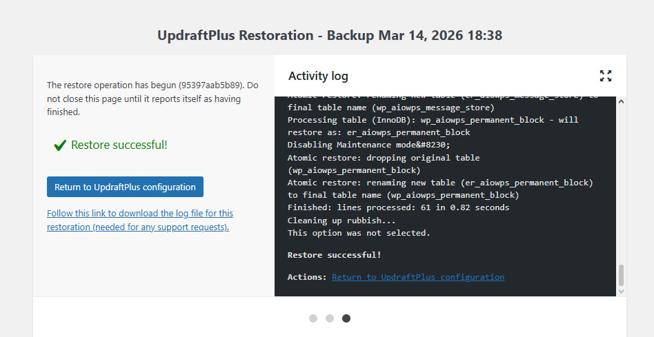

---

# Ответы на контрольные вопросы

### 1. Почему DISALLOW_FILE_EDIT и правильные права на wp-config.php уменьшают риск пост-эксплойта?

Отключение редактора файлов через параметр `DISALLOW_FILE_EDIT` предотвращает возможность изменения файлов темы или плагинов через административную панель WordPress. Если злоумышленник получит доступ к аккаунту администратора, он не сможет внедрить вредоносный код через встроенный редактор.

Правильные права доступа к файлу `wp-config.php` ограничивают возможность его изменения или чтения посторонними пользователями. Поскольку этот файл содержит данные подключения к базе данных и ключи безопасности, его защита существенно снижает риск компрометации сайта.

---

### 2. Какие параметры Login Lockdown и Firewall были выбраны и почему?

Для защиты от перебора паролей были выбраны следующие параметры:

* 5 попыток входа
* период повторной попытки — 15 минут
* блокировка — 30 минут

Такие значения обеспечивают баланс между безопасностью и удобством пользователей. Они предотвращают массовый подбор паролей, но при этом не создают серьёзных проблем для обычных пользователей, которые могли ошибиться при вводе пароля.

---

### 3. Чем отличаются меры защиты WordPress от защиты на уровне сервера?

Защита на уровне WordPress реализуется через плагины и настройки системы управления контентом. Она контролирует доступ пользователей, проверяет запросы и защищает административную часть сайта.

Защита на уровне веб-сервера и операционной системы работает на более низком уровне. Она включает настройку файловых прав, конфигурацию сервера Apache или Nginx, использование firewall и других систем безопасности. Такие меры защищают сервер независимо от работы WordPress.

---

### 4. Что должно входить в полный бэкап WordPress?

Полный бэкап сайта должен включать:

* базу данных WordPress
* папку `wp-content` (темы, плагины, загрузки)
* файлы конфигурации
* медиафайлы

Проверка восстановления выполняется путем восстановления сайта из резервной копии и проверки наличия записей, страниц и изображений.

---

# Вывод

В ходе лабораторной работы были изучены основные методы защиты WordPress. Были настроены права доступа, выполнено базовое hardening системы, установлен и настроен плагин All In One WP Security & Firewall, проверена защита от брутфорса и выполнено восстановление сайта из резервной копии. Полученные навыки позволяют повысить безопасность веб-приложений на основе WordPress.


